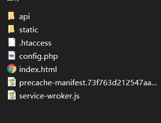

<h1 align="center"><a href="https://nexmoe.com/wall-public.html" target="_blank">Wall-public</a></h1>

>一个基于 Vue.js 的匿名表白墙轻量级小程序

## 目录

- [介绍](#%E4%BB%8B%E7%BB%8D)
- [演示](#%E6%BC%94%E7%A4%BA)
- [许可证](#%E8%AE%B8%E5%8F%AF%E8%AF%81)
- [后续更新](#%E5%90%8E%E7%BB%AD%E6%9B%B4%E6%96%B0)
- [环境准备](#%E7%8E%AF%E5%A2%83%E5%87%86%E5%A4%87)
- [安装](#%E5%AE%89%E8%A3%85)
- [PWA支持](#PWA%E6%94%AF%E6%8C%81)
- [交流](#%E4%BA%A4%E6%B5%81)

## 介绍
一个基于 Vue.js 的匿名表白墙轻量级小程序

## 演示
- [https://ncldzx.top/](https://ncldzx.top/)
- 欢迎大家在 issue 或者 pull request 中添加你部署好的网站链接

## 许可证

根据 Apache License 2.0 许可证开源。

## 环境准备
- 支持 PHP 的服务器，PHP7以上版本最佳
- 支持 Apache 的服务器

## 安装
- 如果你要自定义修改东西的话，去编辑client目录里面的东西
- 也就是/client/src/下的vue文件，然后修改完成后编译
- npm install
- npm run build
- 在client目录下打开命令行，然后输入上面两行代码就行，前提是你电脑山有npm和vue.js的环境
- 编译后的文件在dist目录里面

- 最后只需要这些文件就可以把程序跑起来
- 去releases 下载 zip 包安装
- 将程序解压到网站根目录
- 访问 `域名/install.php` 填写表单安装即可
安不安装其实都可以，只要根目录有config.php文件且配置好了就行
然后personal文件夹里面是一个标准的可以放到服务器上直接跑的文件夹，这个是我自己的信息，大家不用就直接忽略就好
图片上传功能已经修复，改成上传到阿里云oss。
因为功能很简单，我没有做文件类型判断，毕竟阿里云oss也跑不了动态文件，而且上传文件名重命名过，我目前想不到上传可以有什么样子的漏洞。
自己要进`\api\application\models`修改AliYunUpload.php里面的信息，然后还要去/api/application/controllers/Controller.php修改域名等

## PWA支持
service-wroker 已配置好了，只需要修改 `/static/manifest.json` 里面的内容即可
